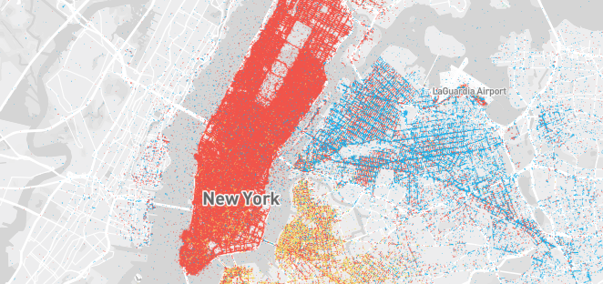

# Database Seminar HSR, Fall 2018
The Database Seminar aims to get familiar with different cloud solutions for relational database and do some benchmarks.
In particular the products to test are Google Cloud Spanner and Azure Database for PostgreSQL-Server.

## Goal
The goal is to interact with the cloud solutions, import some data and query them to get an impression of the products and do a benchmark for comparison.

### Expected results
Beside of a reproducible solution to setup the databases, import the data and execute the queries we expect a paper about cloud solutions for relational database with the following content:
 - Review about Google Cloud Spanner and Azure Database for PostgreSQL-Server (pros, cons, special properties, ...)
 - A benchmark between Google Cloud Spanner and Azure Database for PostgreSQL-Server
 - ...

## Data
The data we are using for the current Database Seminar are the New York City Taxi trips. (http://www.nyc.gov/html/tlc/html/about/trip_record_data.shtml)

### Queries
The queries for the benchmark can be found inside of the queries directory in the queries.sql file.
Be aware of the SQL syntax the queries.sql is written in PostgreSQL syntax and has to be adopted for Cloud Spanner.

### Download
Downloadable CSV files are provided on Amazon S3.
We do only focus on the data from 2015 of the yellow and green taxis.
To download them switch into the data directory and execute the download.py script.
Since it is still a lot of data this may take a while.
```
$ cd data
$ python download.py 
```
After that your data folder should provide the CSV files.

